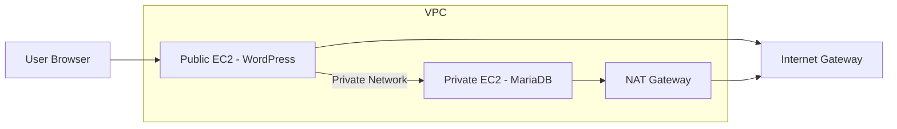

# secure-2tier-aws-architecture
Secure two-tier AWS architecture with Public EC2 bastion and Private MariaDB server using VPC, subnets, NAT Gateway, and security groups.
# 🚀 AWS Two-Tier Architecture: Public EC2 → Private MariaDB

## 📌 Project Overview

This project demonstrates how to securely access a MariaDB database
hosted in a private EC2 instance using a public EC2 bastion host within
an AWS VPC.

------------------------------------------------------------------------

## 🏗️ Architecture Flow

    Internet → Public EC2 (Bastion) → Private EC2 (MariaDB)

------------------------------------------------------------------------

## 🚀 Implementation Steps

### Step 1: Configuration step

### Step 2: Configuration step

### Step 3:  Configuration step

### Step 4:  Configuration step

### Step 5:  Configuration step

### Step 6: Configuration step

### Step 7:  Configuration step

### Step 8:  Configuration step

### Step 9:  Configuration step

### Step 10:  Configuration step

### Step 11: Configuration Step

### Step 12: Configuration Step

### Step 13: Configuration Step

### Step 14: Configuration Step

### Step 15: Configuration Step

### Step 16: Configuration Step

### Step 17: Configuration Step

### Step 18: Configuration Step

### Step 19: Configuration Step

### Step 20: Configuration Step

### Step 21: Configuration Step

### Step 22: Configuration Step

### Step 23: Configuration Step

### Step 24: Configuration Step

### Step 25: Configuration Step

### Step 26: Configuration Step

### Step 27: Configuration Step

### Step 28: Configuration Step

### Step 29: Configuration Step

### Step 30: Configuration Step

### Step 31: Configuration Step

### Step 32: Configuration Step

### Step 33: Configuration Step

### Step 34: Configuration Step

### Step 35: Configuration Step

### Step 36: Configuration Step

### Step 37: Configuration Step

### Step 38: Configuration Step

### Step 39: Configuration Step

------------------------------------------------------------------------

## 🔒 Security Best Practices

-   Database deployed in private subnet

-   Access restricted via bastion host

-   Security groups limit MySQL port (3306)

-   No direct public exposure of database

## 🎯 Result

✔ Successfully connected from public EC2 to private MariaDB instance.

## 🧑‍💻 Author

**Ravi Dhande**

---

## 🏗️ Architecture Diagram

### 🔍 Architecture Explanation

- **Public Subnet:** Hosts WordPress EC2 with public access  
- **Private Subnet:** Hosts MariaDB EC2 (no public IP)  
- **Internet Gateway:** Allows inbound/outbound internet for public subnet  
- **NAT Gateway:** Allows private subnet outbound internet access only  
- **Security Groups:** Control SSH and MySQL access securely  

---
